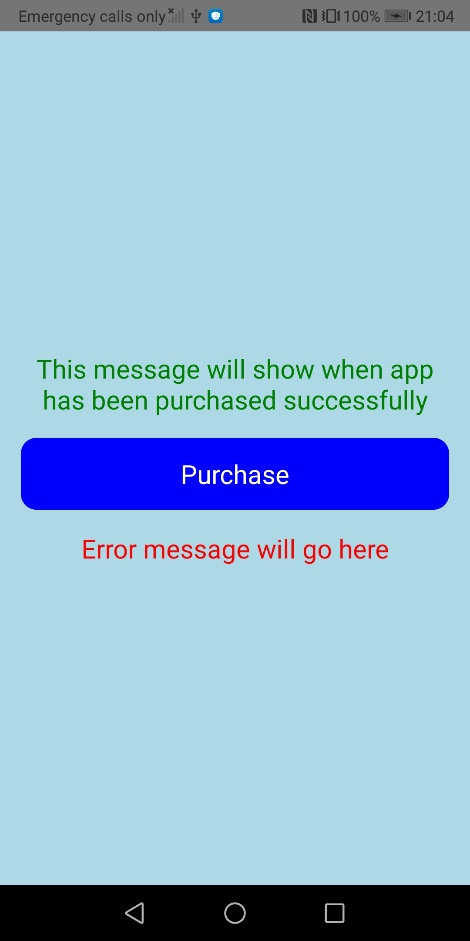

# RN_IAP Example App

This is a simple app to show how to implement a Google Play Store in-app purchase to a React Native app for Android.

Tutorial article: [How to Add In-App Purchases to a React Native Android App for Google Play Store](https://www.doabledanny.com/react-native-iap-example-android)

YouTube tutorial: [React Native In-app Purchases for Android | Example App](https://www.youtube.com/watch?v=nLBoVrAMF04&t=34s)

